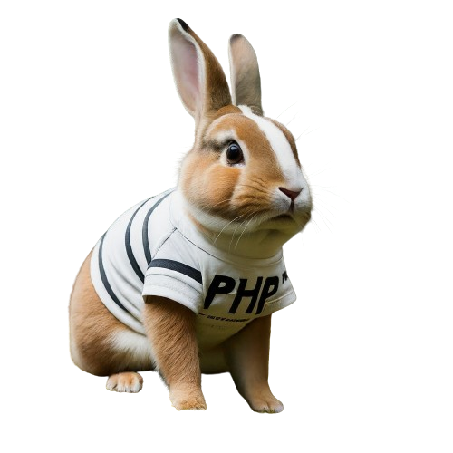

# Laravel-Quiz (mister-quiz)

Laravel-Quiz is a nice lil quiz game in `next.js` and `laravel`! Test your knowledge and let's see whatchu got! Quiz yourself with over 50 questions of various categories, and compare yourself with others!

> ps. i hated preauditing because i couldnt answer a question for the life of me. Like why the heck should i know how many matches mohammad fricking Ali won so that i can test if the result page fricking works. BRUH

## steps to run locally

1. clone this repo
2. run `sudo chmod 777 scripts/*`
3. run `./scripts/backend`
4. run `./scripts/frontend`
5. have fun!

> Please report any errors to the issues tab

### Done by Abdulrahman Idrees (akhaled) and fatima Abbas (fatabbas)
